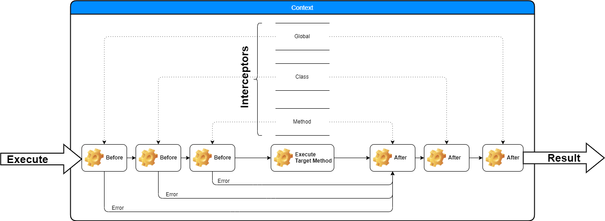

# lib-intercept
<p align="center">


</p>

Library for executing reflected [ClassData](https://github.com/MRazvan/lib-reflect#ClassData) and allowing intercepting of a method execution and result. 
The interceptors can be optimized away on methods that do not need them depending on how the interceptors are implemented.
- At startup (activation generation) - IConfiguration will be executed at Activation generation on interceptors that implement it 
- At runtime - On Before / After handlers can remove the interceptor by using methods on the activation object.

It is using the [lib-reflect](https://github.com/MRazvan/lib-reflect) library in order to generate the needed information for executing a method on a class.

- [lib-intercept](#lib-intercept)
  - [Installation](#installation)
  - [Overview](#overview)
    - [There are several layers of interceptors that can be added.](#there-are-several-layers-of-interceptors-that-can-be-added)
    - [Order of interceptor execution withing a group](#order-of-interceptor-execution-withing-a-group)
      - [Before interceptors](#before-interceptors)
      - [After interceptors](#after-interceptors)
  - [Example](#example)
    - [Simple](#simple)
    - [Custom Context](#custom-context)

## Installation
Standard npm package install
```
npm i lib-intercept
```

## Overview
The execution will happen in an execution context. The execution of the method(s) does not throw even if an error happens. The error will be available on the context result object.

> **The library add's two interceptors by default**
> - An interceptor that scan's the method parameters for types it can find in the `inversify` container
> - The method invocation is implemented as an interceptor that get's the 'IActivation' object from the context and call's the target method on an instance of the target class. The class instance is created using `inversify` if it is bound, meaning you can inject services on the target class.

<br/>

<br/>

### There are several layers of interceptors that can be added.
- At the global level in the **ActivationsGenerator** class. Those interceptors will execute for all methods on all registered classes.
- At the class level, those interceptors will execute only on the methods from that class.
- At the method level, those interceptors will execute only on the target method.
   
The **IContext** will contain information regarding the execution of the target method. Like:
  - The activation information
  - Arguments to be passed to the method (at first it's an array of 'null' with length equal to the number of arguments). It is the job of the interceptors to set values on the arguments.
  - A dictionary to store custom data on the context to be passed around.
  - The result object, it contains either the result of the executing method, or the error.
  - The inversify container used for DI in case we need something in an interceptor.


```typescript
enum KeepActivation {
  NONE = 0x00,
  BEFORE = 0x01,
  AFTER = 0x02
}

interface IConfigureActivation {
  configure(activation: IActivation): KeepActivation;
}

interface IAfterActivation {
  after(context: IContext): Promise<void> | void;
}

interface IBeforeActivation {
  before(context: IContext): Promise<boolean> | boolean;
}

interface IActivation {
  // The reflection information for the target class
  class: ClassData;
  // The reflection information for the target method
  method: MethodData;
  // Before execution activations
  beforeActivation: IBeforeActivation[];
  // After execution activations
  afterActivation: IAfterActivation[];
  // Execute this activation
  execute(ctx: IContext, onError?: ActivationErrorCallback): Promise<any>;
  // Remove a before interceptor from the chain of this method
  removeBeforeActivation(activation: IBeforeActivation, context: IContext): void;
  // Remove an after interceptor from the chain of this method
  removeAfterActivation(activation: IAfterActivation, context: IContext): void;
  // Any data specific for this activation
  data: Record<string, any>;
}

interface IContext {
  // error payload as set by setError
  error: any;
  // result payload as set by setSuccess
  payload: any;
  // Counter to track the execution point in before interceptors
  //  We need this on the context since the interceptors can remnove themselfs from the chain
  beforeActivationIdx: number;
  // The number of before interceptors that we need to execute
  beforeActivationLength: number;
  // Execute the activation (wrapper over activation.execute(ctx))
  execute(): Promise<any>;
  // Get the activation from this execution context
  getActivation(): IActivation;
  // Set the payload / error and make success as true 
  setSuccess(payload: any): boolean;
  // Set the error / payload = null and make success as false
  setError(error: any): boolean;
  // Indicate if we have an error or not
  isSuccess(): boolean;
  // Get the DI container
  getContainer(): Container;
  // Get the arguments used to call the target method
  getArguments(): any[];
  // Set the arguments used to call the target method
  setArguments(args: any[]): void;
  // Dictionary to set custom data on this context
  getData<T>(key: string, defaultVal?: T): T;
  setData(key: string, data: any): void;}
```

### Order of interceptor execution withing a group
The order of interceptor executions within an interceptor group depends on the type of interceptor
#### Before interceptors
The order of the before interceptors is as they are used / defined, in the example bellow the call chain will be I1 -> I2 -> I3.
```typescript
  @UseBefore(I1)
  @UseBefore(I2)
  @UseBefore(I3)

  // Call chain I1 -> I2 -> I3
```

#### After interceptors
The order of the after interceptors is in reverse order of the usage , in the example bellow the call chain will be A1 -> A2 -> A3.
```typescript
  @UseAfter(A3)
  @UseAfter(A2)
  @UseAfter(A1)

  // Call chain A1 -> A2 -> A3
```
The reason is that we can't add decorators after a method. Ideally we would have
```typescript
  @UseBefore(I1)
  @UseBefore(I2)
  public myMethod(){}
  @UseAfter(A2)
  @UseAfter(A1)
```
So we are left with figuring out a way to set interceptors and still know how they are executed, so the way this library does it, is basically moving the interceptors from the example above, on top of the method.
```typescript
  @UseBefore(I1)
  @UseBefore(I2)
  //public myMethod(){}
  @UseAfter(A2)
  @UseAfter(A1)
  public myMethod(){}

  // I1 -> I2 -> myMethod() -> A2 -> A1
```
<br/>

> *You can mix and match the usage of the decorators, however that will make it a lot harder to understand the ordering*
> ```typescript
> @UseBefore(I1)
> @UseAfter(A2)
> @UseBefore(I2)
> @UseBefore(I3)
> @UseAfter(A1)
> ```
## Example
For a complex example go to [lib-intercept-example](https://github.com/MRazvan/lib-intercept-example)

### Simple
```typescript
// Interceptors for method execution
class Log implements IBeforeActivation {
  public before(ctx: IContext): boolean {
    console.log('BEFORE: ', ctx.getActivation());
    // Let the execution continue after this method
    return true;
  }
}

class Performance implements IBeforeActivation, IAfterActivation {
  public before(ctx: IContext): boolean {
    console.log('Start Performance');
    ctx.setData('Start', process.hrtime());
    // Let the execution continue after this method
    return true;
  }
  public after(ctx: IContext): void {
    const start = ctx.getData<[number, number]>('Start');
    const time = process.hrtime(start);
    console.log(`Took : ${time[0] * 1000 + time[1] / 1e6} ms`);
  }
}

// Create a test class
class TestClass {
  // Decorate with the logger
  @UseBefore(Log)
  @UseActivation(Performance)
  public myMethod(): string {
    return 'From my handler';
  }
}

const generator = new ActivationsGenerator();
// We can register as many classes as we want, for this example we only have one
generator.register(TestClass);
// Generate the activations
// We have only one class with one method however we also have a 'constructor' method
//  We don't need to check the class name since we only registered one
const activation = generator.generateActivations(container).find(a => a.method.name === 'myMethod');
// Create the context of execution
const context = new DefaultContext(new Container(), activation);
context.execute().then(() => {
  console.log('RESULT', context.payload);
});
```

### Custom Context
An example of a custom context for integrating with express and passing the request / response objects to interceptors
```typescript
// Either extend or implement a custom IContext
class HttpContext extends DefaultContext {
  constructor(
    container: Container,
    activation: IActivation,
    private readonly _req: express.Request,
    private readonly _res: express.Response
  ) {
    super(container, activation);
  }

  public getRequest(): express.Request {
    return this._req;
  }

  public getResponse(): express.Response {
    return this._res;
  }
}
...
class AuthorizationInterceptor ... {
  // Use our HTTP Context in a custom interceptor for example to check for a token
  public before(ctx: HttpContext): boolean {
    if (isNil(ctx.getRequest().headers['authorization'])){
      return ctx.setError('Unauthorized');
      // Or just ** throw new Error('Unauthorized'); ** the library will take care of setting the error
    }
    // Process the header and the target method
    return true;
  }
}
// In the request handler
const ctx = new HttpContext(container, activation, req, res);
ctx.execute().then(() => {
  // This example does not check for error, it just sends the result as json
  res.json(ctx.payload);
  /*
    if (!ctx.isSuccess()) res.status(400).send(ctx.error) // Send an error 
    else res.json(ctx.payload) // Send the result
  */
});
```